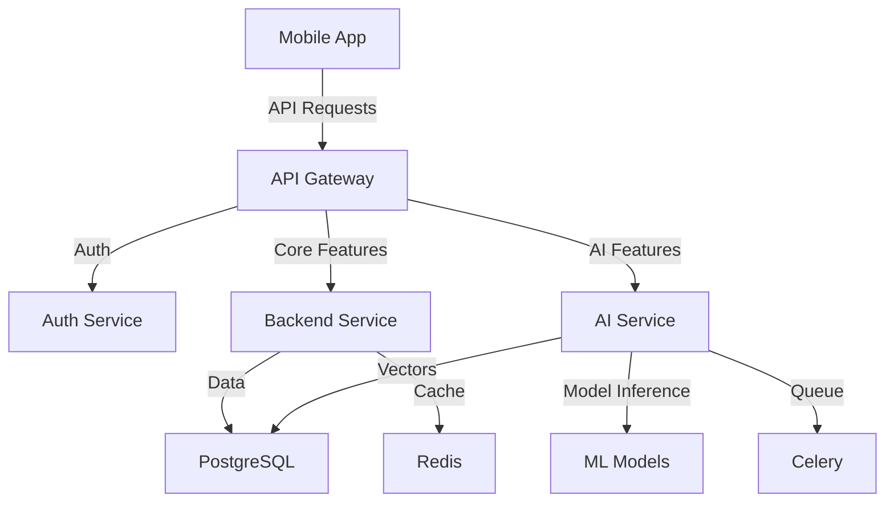

## Technical Architecture Document

### 1. Overview

This document outlines the technical architecture for our AI-powered fitness application. The project follows a monorepo structure and utilizes modern technologies to deliver a scalable, performant, and maintainable solution.

### 2. Repository Structure

```
fitholic/
├── .github/                    # GitHub Actions workflows
├── apps/                       # Application packages
│   ├── mobile/                # React Native mobile app
│   ├── api/                   # FastAPI backend service
│   └── ai/                    # AI/ML services
├── libs/                      # Shared libraries
│   ├── common/                # Common utilities and types
│   ├── database/             # Database models and migrations
│   └── ai-models/            # AI model definitions and utilities
├── tools/                     # Development and build tools
├── docs/                      # Documentation
└── pyproject.toml            # Python project configuration
```

### 3. Technology Stack

#### 3.1 Package Management
- **uv**: Modern Python package manager for fast, reliable dependency management
- **Poetry**: For dependency management and packaging in Python
- **yarn**: For JavaScript/TypeScript package management

#### 3.2 Frontend (Mobile)
- **Framework**: React Native
- **State Management**: Redux Toolkit
- **Navigation**: React Navigation
- **UI Components**: Custom component library
- **Testing**: Jest, React Native Testing Library
- **Build Tools**: Metro bundler

#### 3.3 Backend
- **Framework**: FastAPI
- **API Documentation**: OpenAPI (Swagger)
- **Authentication**: Supabase Auth
- **Testing**: pytest
- **Task Queue**: Celery with Redis
- **Caching**: Redis

#### 3.4 Database
- **Primary Database**: PostgreSQL (via Supabase)
- **Schema Management**: Alembic migrations
- **ORM**: SQLAlchemy

#### 3.5 AI/ML Infrastructure
- **Workflow Orchestration**: LangChain
- **LLM Integration**: Gemini Pro
- **Computer Vision**: MediaPipe
- **Model Serving**: FastAPI endpoints
- **Vector Store**: pgvector (PostgreSQL extension)

#### 3.6 Infrastructure
- **Cloud Platform**: AWS
- **Container Orchestration**: Kubernetes (EKS)
- **CI/CD**: GitHub Actions
- **Monitoring**: Prometheus + Grafana
- **Logging**: ELK Stack
- **Storage**: S3 for assets, Supabase Storage for user content

### 4. System Components

#### 4.1 Mobile Application
- Implements offline-first architecture
- Uses atomic design pattern for UI components
- Implements clean architecture with domain-driven design
- Features modular structure for feature isolation

#### 4.2 Backend Services
- Implements hexagonal architecture
- Uses domain-driven design principles
- Features modular service structure
- Implements CQRS pattern for complex operations

#### 4.3 AI Services
- Separate service for AI/ML operations
- Asynchronous processing for heavy computations
- Model versioning and A/B testing capabilities
- Feedback loop for model improvements

### 5. Data Flow



### 6. Security Architecture

- JWT-based authentication
- Role-based access control (RBAC)
- API rate limiting
- Input validation and sanitization
- Encryption at rest and in transit
- Regular security audits

### 7. Scalability Considerations

#### 7.1 Horizontal Scaling
- Stateless services for easy replication
- Database read replicas
- Caching strategy with Redis
- Load balancing with AWS ALB

#### 7.2 Performance Optimization
- CDN for static assets
- Database query optimization
- Caching strategies
- Lazy loading of features
- Background job processing

### 8. Development Workflow

#### 8.1 Version Control
- Feature branch workflow
- Conventional commits
- Automated versioning
- Pull request templates

#### 8.2 CI/CD Pipeline
- Automated testing
- Code quality checks
- Security scanning
- Automated deployments
- Environment promotion

### 9. Monitoring and Observability

- Application metrics
- Business metrics
- Error tracking
- Performance monitoring
- User analytics
- Distributed tracing

### 10. Disaster Recovery

- Regular backups
- Multi-region deployment
- Failover procedures
- Data recovery plans
- Incident response plans

### 11. Development Guidelines

#### 11.1 Code Standards
- Python: PEP 8
- TypeScript: ESLint + Prettier
- Pre-commit hooks
- Code review guidelines

#### 11.2 Documentation
- API documentation
- Architecture decision records (ADRs)
- Component documentation
- Setup guides

### 12. Future Considerations

- GraphQL API evolution
- Microservices migration path
- Edge computing capabilities
- Real-time features
- Machine learning pipeline automation

This architecture provides a solid foundation for building a scalable and maintainable AI-powered fitness application while allowing for future growth and evolution of the system.
