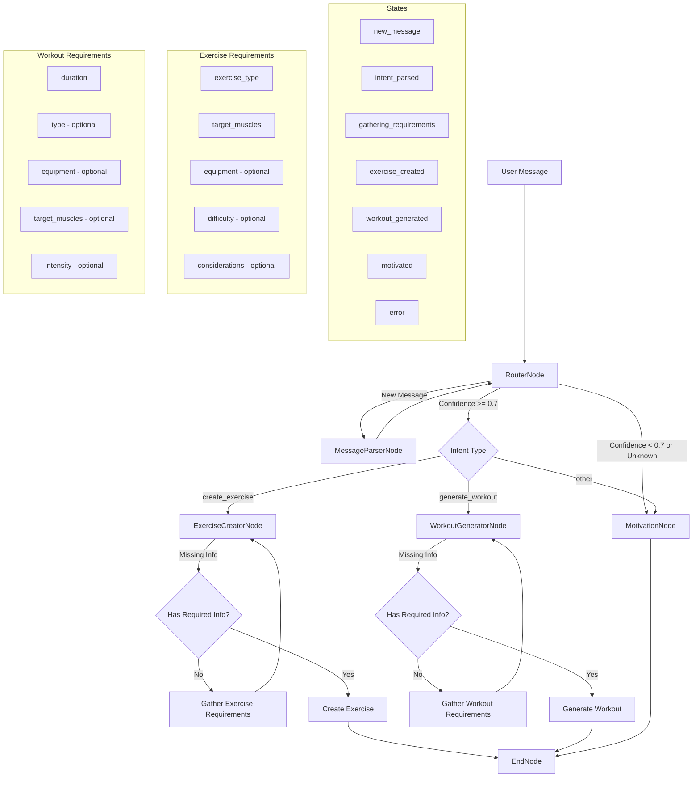

## Fitness Chatbot Architecture

### Overview
The fitness chatbot is designed to handle various fitness-related queries using LangGraph for conversation flow management and integrates with existing AI services for exercise and workout generation.

### Key Features
1. **Session Logging**: "I have completed the today's session"
2. **Exercise Creation**: "Suggest me an exercise"
3. **Workout Generation**: "I have 20 minutes to workout"

### Directory Structure
```
apps/api/app/
├── agents/
│   ├── nodes/
│   │   ├── chat/
│   │   │   ├── message_parser.py      # Parse user messages and identify intents
│   │   │   ├── workout_logger.py      # Handle workout logging
│   │   │   ├── exercise_creator.py    # Handle exercise creation
│   │   │   └── workout_generator.py   # Handle workout generation
│   │   └── base.py
│   ├── workflows/
│   │   ├── chat/
│   │   │   └── fitness_chat.py        # Main chat workflow
│   │   └── workout_generation.py
│   └── config.py
├── services/
│   ├── ai/
│   │   ├── chat_service.py           # High-level chat service
│   │   ├── exercise_generator.py
│   │   └── workout_generator.py
│   └── chat/
│       ├── history.py                # Chat history management
│       └── context.py                # Conversation context management
└── models/
    └── chat.py                       # Chat-related database models
```

### Database Schema
```sql
-- Chat Sessions
CREATE TABLE chat_sessions (
    session_id UUID PRIMARY KEY DEFAULT uuid_generate_v4(),
    user_id UUID NOT NULL REFERENCES users(user_id),
    status TEXT NOT NULL DEFAULT 'active',
    created_at TIMESTAMP WITH TIME ZONE DEFAULT now(),
    updated_at TIMESTAMP WITH TIME ZONE DEFAULT now()
);

-- Chat Messages
CREATE TABLE chat_messages (
    message_id UUID PRIMARY KEY DEFAULT uuid_generate_v4(),
    session_id UUID NOT NULL REFERENCES chat_sessions(session_id),
    role TEXT NOT NULL, -- 'user' or 'assistant'
    content TEXT NOT NULL,
    metadata JSONB, -- Store additional message metadata
    created_at TIMESTAMP WITH TIME ZONE DEFAULT now()
);

-- Chat Context
CREATE TABLE chat_context (
    context_id UUID PRIMARY KEY DEFAULT uuid_generate_v4(),
    session_id UUID NOT NULL REFERENCES chat_sessions(session_id),
    context_type TEXT NOT NULL, -- e.g., 'workout_logging', 'exercise_creation'
    context_data JSONB NOT NULL, -- Store conversation context
    created_at TIMESTAMP WITH TIME ZONE DEFAULT now(),
    updated_at TIMESTAMP WITH TIME ZONE DEFAULT now()
);
```

### Core Components

1. **Message Parser Node**
   - Identifies user intents from messages
   - Extracts relevant parameters
   - Supports intents: log_workout, create_exercise, generate_workout

2. **Fitness Chat Workflow**
   - Manages conversation flow using LangGraph
   - Routes messages based on identified intents
   - Maintains conversation state and context

3. **Chat Service**
   - High-level service for managing chat interactions
   - Handles chat history and context management
   - Integrates with existing AI services

### Key Benefits
1. Uses LangGraph for managing conversation flow
2. Integrates with existing exercise and workout generation services
3. Maintains conversation context and history
4. Provides structured handling of different intents
5. Extensible for adding new conversation capabilities

### Implementation Notes
- Uses existing LLM configurations from `llm_config.py`
- Integrates with existing exercise and workout generators
- Follows the same architectural patterns as other AI services
- Maintains conversation state using LangGraph
- Stores chat history and context in PostgreSQL

### Workflow Diagram



### State Transitions
1. `new_message` → `intent_parsed`: Initial message parsing
2. `intent_parsed` → `gathering_requirements`/`motivated`: Based on intent confidence
3. `gathering_requirements` → `exercise_created`/`workout_generated`: After collecting required info
4. Any state can transition to `error` on exception

### Implementation Summary

The fitness chatbot has been implemented with the following key components:

1. **Database Layer**
   - Chat sessions for tracking conversations
   - Message history for maintaining context
   - Chat context for storing state information
   - Integration with user profiles

2. **Core Components**
   - **MessageParserNode**: Identifies intents with confidence scoring
   - **ExerciseCreatorNode**: Handles exercise creation workflow
   - **WorkoutGeneratorNode**: Manages workout generation process
   - **MotivationNode**: Provides general fitness guidance
   - **RouterNode**: Manages conversation flow
   - **EndNode**: Handles conversation termination

3. **Workflow Management**
   - LangGraph-based state management
   - Conditional routing based on intent confidence
   - Requirement gathering loops for exercise and workout creation
   - Error handling and recovery mechanisms

4. **Integration Points**
   - Exercise generation service
   - Workout planning service
   - User profile service
   - Chat history service

### Current Status

1. **Implemented Features**
   - Basic conversation flow
   - Intent recognition
   - Exercise creation workflow
   - Workout generation workflow
   - Motivational responses
   - State management
   - Error handling

2. **Pending Enhancements**
   - User profile integration for personalized responses
   - Enhanced exercise recommendations
   - Workout progress tracking
   - Natural language workout logging
   - Multi-turn conversation improvements

3. **Known Limitations**
   - Limited context window for conversation history
   - Basic error recovery mechanisms
   - Simple intent classification model
   - Limited personalization

4. **Next Steps**
   - Enhance context management
   - Improve error handling
   - Add more sophisticated intent recognition
   - Implement better personalization
   - Add support for complex multi-turn conversations


